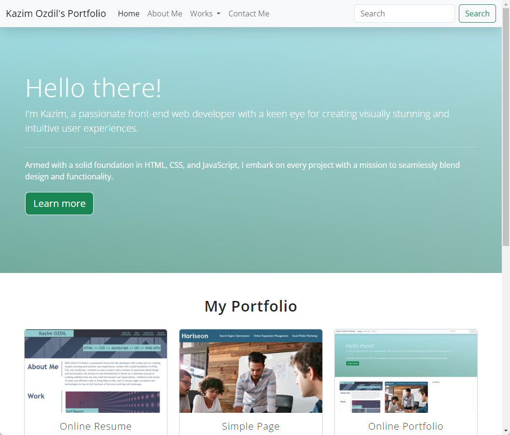

  

  <h3 align="center">Online Portfolio</h3>

  

    An online portfolio project creted by K.Ozdil for Bootcamp challange activity.
     
    <a href="https://getbootstrap.com/docs/4.0/"><strong>Explore Bootstrap docs &raquo;</strong></a>
     
     
    <a href="https://themes.getbootstrap.com/">Bootstrap Themes</a>
    &middot;
    <a href="https://jobs.getbootstrap.com/">Job Board</a>
    &middot;
    <a href="https://blog.getbootstrap.com/">Blog</a>
  

 

### Documentation for previous releases

- No previous release.

## Community

Get updates on Bootstrap's development and chat with the project maintainers and community members.

- Follow [@getbootstrap on Twitter](https://twitter.com/getbootstrap).
- Read and subscribe to [The Official Bootstrap Blog](https://blog.getbootstrap.com/).
- Join [the official Slack room](https://bootstrap-slack.herokuapp.com/).
- Chat with fellow Bootstrappers in IRC. On the `irc.freenode.net` server, in the `##bootstrap` channel.
- Implementation help may be found at Stack Overflow (tagged [`bootstrap-4`](https://stackoverflow.com/questions/tagged/bootstrap-4)).
- Developers should use the keyword `bootstrap` on packages which modify or add to the functionality of Bootstrap when distributing through [npm](https://www.npmjs.com/browse/keyword/bootstrap) or similar delivery mechanisms for maximum discoverability.

## Creator(s)

**Kazim OZDIL**

- <https://github.com/ozdilkazim>

## Copyright and license

Code and documentation copyright 2011-2017 the [Bootstrap Authors](https://github.com/twbs/bootstrap/graphs/contributors) and [Twitter, Inc.](https://twitter.com) Code released under the [MIT License](https://github.com/twbs/bootstrap/blob/master/LICENSE). Docs released under [Creative Commons](https://github.com/twbs/bootstrap/blob/master/docs/LICENSE).
